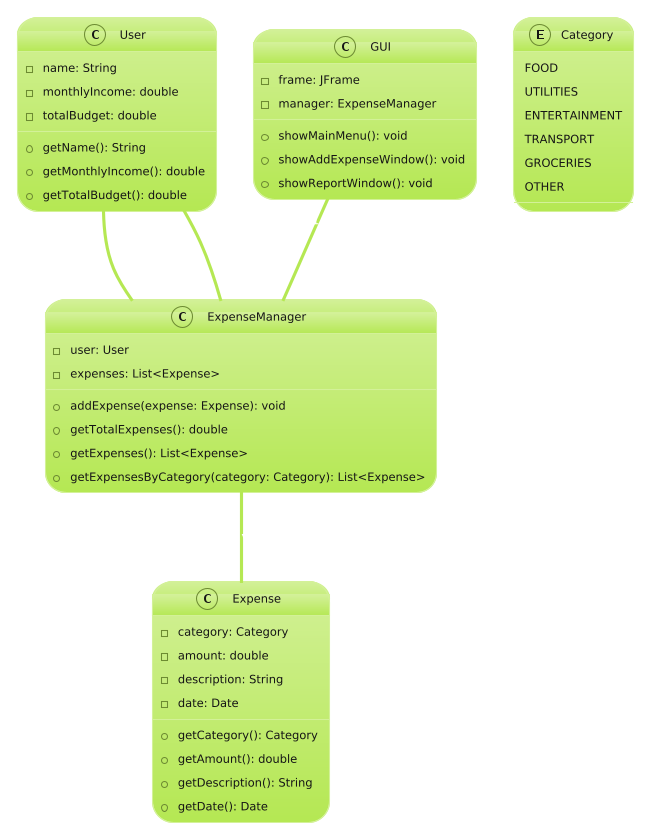

# Expense Manager

## Overview
This project is an **Expense Manager** application designed to help users manage their expenses efficiently. The system allows users to record their expenses, categorize them, and generate reports.

## Features
- **User Management**: Users have a total budget and monthly income.
- **Expense Tracking**: Users can add expenses categorized under different categories such as Food, Utilities, Entertainment, Transport, Groceries, and Others.
- **Expense Manager**: Keeps track of all expenses and allows fetching expenses based on categories.
- **Graphical User Interface (GUI)**: A user-friendly interface to interact with the system.

## Class Diagram


## Class Details
### **User**
Represents a user of the expense manager.
- Attributes:
  - `name`: User's name.
  - `monthlyIncome`: User's monthly income.
  - `totalBudget`: User's total budget.
- Methods:
  - `getName()`: Returns the user's name.
  - `getMonthlyIncome()`: Returns the user's monthly income.
  - `getTotalBudget()`: Returns the user's total budget.

### **Expense**
Represents an expense.
- Attributes:
  - `category`: The category of the expense.
  - `amount`: The amount spent.
  - `description`: Description of the expense.
  - `date`: Date of the expense.
- Methods:
  - `getCategory()`: Returns the category.
  - `getAmount()`: Returns the amount spent.
  - `getDescription()`: Returns the description.
  - `getDate()`: Returns the date of the expense.

### **ExpenseManager**
Manages all user expenses.
- Attributes:
  - `user`: Associated user.
  - `expenses`: List of expenses.
- Methods:
  - `addExpense(expense)`: Adds an expense.
  - `getTotalExpenses()`: Returns the total expenses.
  - `getExpenses()`: Returns all expenses.
  - `getExpensesByCategory(category)`: Returns expenses filtered by category.

### **Category**
An enumeration defining expense categories:
- `FOOD, UTILITIES, ENTERTAINMENT, TRANSPORT, GROCERIES, OTHER`

### **GUI**
Provides the graphical user interface for the system.
- Attributes:
  - `frame`: The JFrame container.
  - `manager`: The ExpenseManager instance.
- Methods:
  - `showMainMenu()`: Displays the main menu.
  - `showAddExpenseWindow()`: Displays the add expense screen.
  - `showReportWindow()`: Displays the expense report.

## How to Run
1. Clone the repository:
   ```sh
   git clone https://github.com/your-username/expense-manager.git
   cd expense-manager
   ```
2. Compile the Java files:
   ```sh
   javac *.java
   ```
3. Run the application:
   ```sh
   java Main
   ```

## Technologies Used
- **Java** (Core logic and OOP implementation)
- **Java Swing** (GUI)
- **Collections Framework** (Handling expenses list)

## Future Enhancements
- Implement database storage for expenses.
- Add authentication for multiple users.
- Introduce charts and graphs for better expense visualization.
- Implement export functionality to save reports as CSV or PDF.

## Contribution
Feel free to contribute to this project. Fork the repository, make changes, and create a pull request!

## License
This project is licensed under the MIT License
